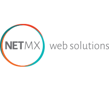

# Pedro Durán

**Data Engineer · Databricks · PySpark · Power BI · Microsoft Fabric**

---

## 💼 Experiencia profesional

<table>
<tr>
<td width="100"></td>
<td>
<b>MARDAN BUSINESS SOLUTIONS SL</b> 
Data Engineer · Sep 2024 – Presente · Badajoz, Extremadura  
- Pipelines <b>ETL/ELT</b> en <b>Databricks</b> con <b>PySpark</b> y <b>Delta Lake</b> 
- Arquitectura <b>Medallion</b> (Bronze → Silver → Gold) para ingesta y calidad del dato 
- Integración de fuentes con <b>Azure Data Factory (ADF)</b> 
- Sistemas de monitorización con <b>Spark Structured Streaming</b> 
- Dashboards e informes en <b>Power BI</b> y <b>Microsoft Fabric</b>  
<code>Databricks</code> <code>PySpark</code> <code>Delta Lake</code> <code>ADF</code> <code>Power BI</code> <code>Microsoft Fabric</code> <code>Azure</code>
</td>
</tr>
<tr>
<td width="100"></td>
<td>
<b>NetMX</b> 
Desarrollo y Coordinación Técnica · Abr 2025 – Jun 2025 · Remoto, Madrid  
- MVP full-stack para análisis de riesgos empresariales 
- Backend con <b>Flask</b> y <b>MongoDB</b>, frontend con <b>React</b> 
- Integración de <b>APIs REST</b> con autenticación <b>JWT</b> 
- Coordinación técnica del equipo en remoto  
<code>React</code> <code>Flask</code> <code>MongoDB</code> <code>REST APIs</code> <code>JWT</code>
</td>
</tr>
</table>

---

## 🏅 Certificaciones

### ✅ Obtenidas

<table>
<tr>
<td width="120"></td>
<td valign="middle">
<b><a href="https://credentials.databricks.com/1674c522-6a7b-467b-a684-30c57db44091">Databricks Certified Data Engineer Associate</a></b> 
nov. 2025 – nov. 2027
</td>
</tr>
<tr>
<td width="120"></td>
<td valign="middle">
<b>Microsoft Certified: Azure Data Fundamentals</b> 
DP-900
</td>
</tr>
<tr>
<td width="120"></td>
<td valign="middle">
<b>Microsoft Certified: Power Platform Fundamentals</b> 
PL-900
</td>
</tr>
</table>

### 🔄 En progreso

<table>
<tr>
<td width="120"></td>
<td valign="middle">
<b>Microsoft Certified: Fabric Data Engineer Associate</b> 
DP-700 · En progreso
</td>
</tr>
<tr>
<td width="120"></td>
<td valign="middle">
<b>Databricks Certified Associate Developer for Apache Spark</b> 
En progreso
</td>
</tr>
</table>

---

## 🛠️ Tech Stack

**☁️ Cloud & Big Data**

**📊 BI & Visualización**

**💻 Lenguajes**

**🌐 Web & Backend**

**🤖 Machine Learning & AI**

**🗄️ Bases de datos**

**🗣️ Idiomas**

---

## 🎓 Formación académica

<table>
<tr>
<td width="80"></td>
<td valign="middle">
<b>Máster en Visual Analytics & Big Data</b> — UNIR (2024–2025) 
<em>ML supervisado/no supervisado, Deep Learning, NLP, Power BI, Tableau, NoSQL</em>
</td>
</tr>
<tr>
<td width="80"></td>
<td valign="middle">
<b>Grado en Matemáticas</b> — Universidad de Extremadura (2019–2024) 
<em>Estadística, Series temporales (ARIMA), Procesos estocásticos, Modelado predictivo</em>
</td>
</tr>
</table>

---

## 🚀 Proyectos destacados

| Proyecto | Descripción | Stack |
|---|---|---|
| [📦 Respository_PedroDuran](https://github.com/PedroDuranWorks/Respository_PedroDuran) | Proyectos de Data Engineering e ingeniería del dato | Databricks · PySpark · Python · SQL |

---

## 📬 Contacto

